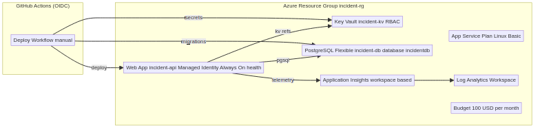
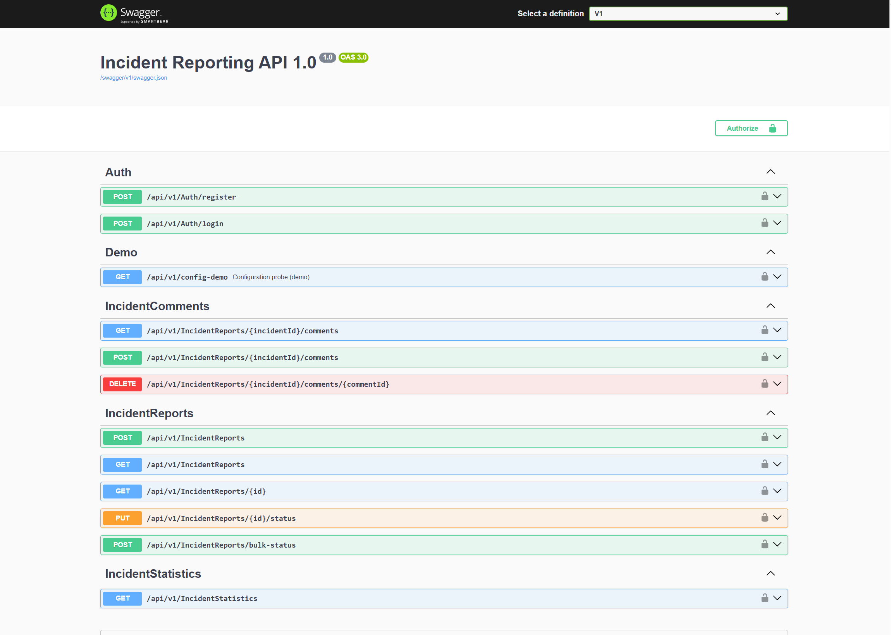
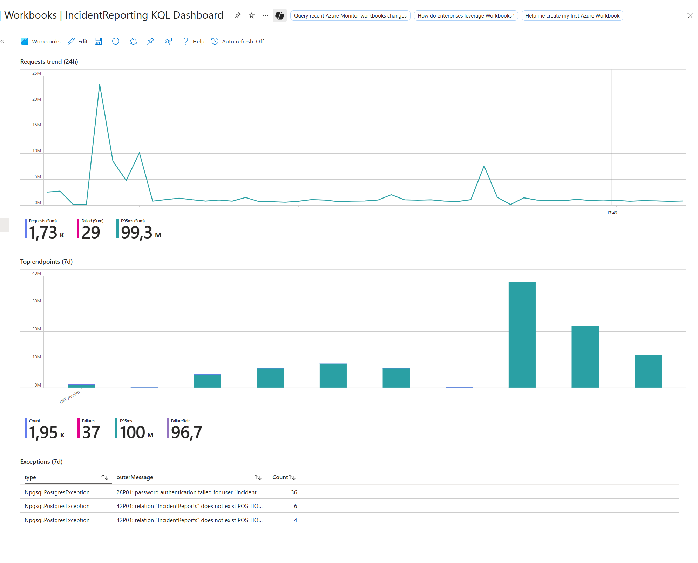
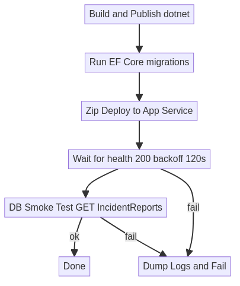

# IncidentReportingSystem — .NET 8 API on Azure (Terraform) + Upcoming UI

[](https://github.com/guysneh/IncidentReportingSystem/actions/workflows/deploy.yml))
[](<YOUR_COVERAGE_REPORT_URL>)

A compact, production‑minded **.NET 8 Web API** showcasing clean architecture, JWT security, **observability by default**, and **Terraform‑first** Azure infrastructure.  
A lightweight **UI** is planned and tracked in the *Roadmap* section below.

> Live Swagger: https://incident-api.azurewebsites.net/swagger/index.html

---

## Table of Contents
- [Highlights](#highlights)
- [Architecture](#architecture)
- [Screenshots](#screenshots)
- [Tech Stack](#tech-stack)
- [Getting Started](#getting-started)
- [Security](#security)
- [Observability](#observability)
- [Infrastructure (Terraform)](#infrastructure-terraform)
- [CI/CD](#cicd)
- [API Quick Demo (curl)](#api-quick-demo-curl)
- [Testing](#testing)
- [Roadmap (UI + backlog)](#roadmap-ui--backlog)
- [Conventions](#conventions)
- [License](#license)

---

## Highlights
- **Clean Architecture** boundaries (Domain, Application, Infrastructure, API) with clear responsibilities.
- **.NET 8** (ASP.NET Core) with **MediatR** command/query handlers and **FluentValidation**.
- **API Versioning** (v1 now), enums rendered as strings in OpenAPI.
- **Security:** Signed **JWT (HS256)**, ValidateIssuer/Audience/Lifetime, roles & claims; `[Authorize]` baked into controllers.
- **Resilience:** Timeouts + `CancellationToken` honored end‑to‑end; developer‑friendly problem details on errors.
- **Observability:** **Application Insights** + **KQL** queries, structured logs with correlation IDs, `/health` endpoint.
- **Infra as Code:** Terraform modules (RG, App Service/Plan, PostgreSQL Flexible Server, Key Vault, App Insights, budget/tags). Managed Identity with **Key Vault references** in App Service.
- **CI/CD:** GitHub Actions (OIDC) — build → unit + integration tests → deploy to Azure.
- **Cost awareness:** Global tagging via `var.default_tags`, budget guardrails.
- **Database:** EF Core with migrations; PostgreSQL Flexible Server.

---

## Architecture

```
repo-root/
├─ src/
│  ├─ IncidentReportingSystem.API/              # ASP.NET Core (.NET 8), Swagger, versioning
│  ├─ IncidentReportingSystem.Application/      # MediatR, validators, DTOs
│  ├─ IncidentReportingSystem.Domain/           # Entities, enums, domain logic
│  └─ IncidentReportingSystem.Infrastructure/   # EF Core, repositories, JWT, logging
├─ tests/
│  ├─ Unit/
│  └─ Integration/                              # WebApplicationFactory, authenticated HttpClient
├─ terraform/
│  ├─ main.tf / variables.tf / outputs.tf
│  └─ modules/
│     ├─ resource_group/  ├─ app_service_plan/ ├─ app_service/
│     ├─ postgres/        ├─ key_vault/        └─ app_insights/
└─ docs/
   └─ images/
      ├─ architecture.png
      ├─ swagger.png
      ├─ kql-dashboard.png
      └─ pipeline.png
```

### Diagram


> **Where to put images:** save your existing diagrams/screenshots into `docs/images` with the exact names above.  
> If you create new ones, add them to this folder and reference them like ``.

---

## Screenshots

**Swagger**


**KQL Dashboard (Application Insights)**


**CI/CD Pipeline**


---

## Tech Stack
- **Backend:** .NET 8, ASP.NET Core, MediatR, FluentValidation, API Versioning
- **Data:** Entity Framework Core, PostgreSQL Flexible Server
- **Security:** JWT (HS256), ValidateIssuer/Audience/Lifetime, roles & claims
- **Observability:** Application Insights, KQL
- **Infra:** Terraform (Azure: App Service Linux, Key Vault, App Insights, Budgets/Tags)
- **CI/CD:** GitHub Actions (OIDC to Azure)

---

## Getting Started

### Prerequisites
- .NET 8 SDK
- PostgreSQL (local) or Azure PostgreSQL Flexible Server
- PowerShell/Bash
- (Optional) Azure CLI for cloud deployment

### Run locally
```bash
# From repo root:
dotnet restore
dotnet build

# Run API (Development profile reads appsettings.Development.json)
dotnet run --project src/IncidentReportingSystem.API
```

The API will expose Swagger UI at `https://localhost:5xxx/swagger` (port per launchSettings).

### EF Core Migrations (local)
```bash
# Create a migration
dotnet ef migrations add Init --project src/IncidentReportingSystem.Infrastructure --startup-project src/IncidentReportingSystem.API

# Apply migrations
dotnet ef database update --project src/IncidentReportingSystem.Infrastructure --startup-project src/IncidentReportingSystem.API
```

---

## Security
- HS256 **JWT** issued for demo via `/api/v1/Auth/token?userId=…&role=…` (issuer/audience/lifetime validated).
- Roles/claims drive `[Authorize]` attributes.
- No secrets in code. App Service uses **Key Vault references** (ConnectionStrings__DefaultConnection, Jwt__Issuer/Audience/Secret).

---

## Observability
- **Application Insights** connection is provided via `APPLICATIONINSIGHTS_CONNECTION_STRING`.
- Structured logging with correlation IDs; request/response + failures captured.
- **KQL** examples in `docs/kql/` (create this folder if missing).
- Health endpoint: `/health`.

---

## Infrastructure (Terraform)
- Modules: `resource_group`, `app_service_plan`, `app_service`, `postgres`, `key_vault`, `app_insights`, `budget`.
- **Always tag** resources with `tags = var.default_tags`.
- PostgreSQL firewall rules: allow App Service outbound IPs (or AllowAllAzureIPs for demo).
- Secrets:
  - `PostgreSqlConnectionString`
  - `jwt-issuer`, `jwt-audience`, `jwt-secret`
- App settings in App Service:
  - `ConnectionStrings__DefaultConnection` → Key Vault reference
  - `Jwt__Issuer`, `Jwt__Audience`, `Jwt__Secret` → Key Vault references
  - `EnableSwagger=true`

**Apply**
```bash
cd terraform
terraform init -upgrade
terraform validate
terraform plan
terraform apply
```

---

## CI/CD
- GitHub Actions with **OIDC** to Azure.
- Jobs: build → test (unit + integration) → publish → deploy to App Service.
- EF Core migrations can be toggled during deploy as needed.

Add a build badge at the top of this README:  
GitHub → Actions → your workflow → ⋯ → **Create status badge** and replace the placeholders.

---

## API Quick Demo (curl)

Get a demo **JWT** (role=Admin):
```bash
curl "https://incident-api.azurewebsites.net/api/v1/Auth/token?userId=demo-admin&role=Admin"
```

Create an incident:
```bash
TOKEN="<paste token>"
curl -X POST "https://incident-api.azurewebsites.net/api/v1/IncidentReports"   -H "Authorization: Bearer $TOKEN" -H "Content-Type: application/json"   -d '{
    "description":"Payment service outage",
    "location":"Berlin",
    "reporterId":"ops-42",
    "category":"Infrastructure",
    "systemAffected":"Payments",
    "severity":"High"
  }'
```

List incidents:
```bash
curl -H "Authorization: Bearer $TOKEN" "https://incident-api.azurewebsites.net/api/v1/IncidentReports?status=Open&severity=High"
```

Update status:
```bash
curl -X PUT "https://incident-api.azurewebsites.net/api/v1/IncidentReports/{id}/status"   -H "Authorization: Bearer $TOKEN" -H "Content-Type: application/json"   -d '{"newStatus":"InProgress"}'
```

---

## Testing
- **Unit tests** focus on handlers/validators.
- **Integration tests** use `WebApplicationFactory` with authenticated `HttpClient` and seeded PostgreSQL.
- Both test suites run in CI; failures block deployment.

---

## Roadmap (UI + backlog)
### UI (planned)
- Minimal **React/Next.js** admin for incident list, details, and status updates.
- Auth via demo JWT; later, wire to real IdP if needed.
- Simple charts (open vs. resolved, by severity).

### Backend backlog
- Pagination & sorting on list endpoint.
- Idempotency keys for create.
- Rate limiting & circuit breaker guards.
- More KQL dashboards.

> **Changelog cadence:** README is updated **weekly** or after every significant milestone (UI views, new endpoints, infra changes).

---

## Conventions
- Language: **English** for code, comments, commits, and docs.
- No secrets in code or plain terraform files; use Key Vault references.
- Keep modules cohesive and tagged (`var.default_tags`).

---

## License
MIT (or choose a license appropriate for your repo).
