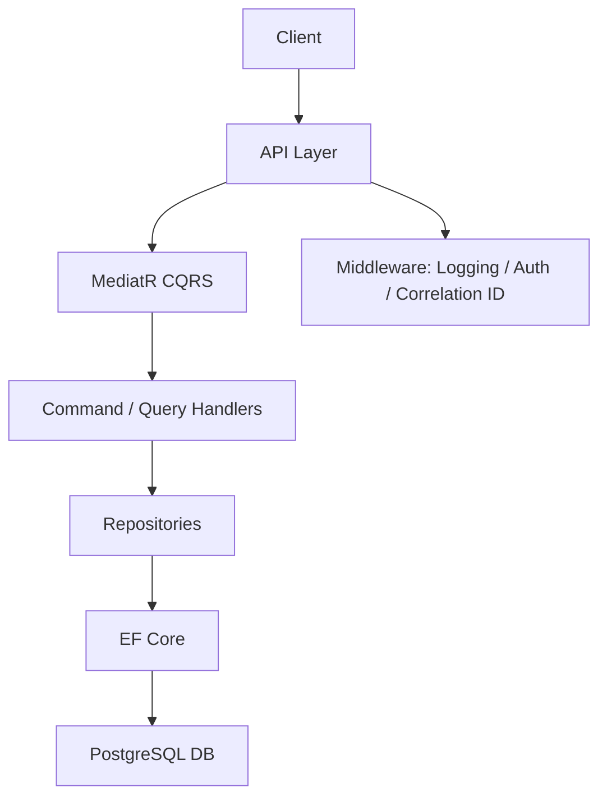

# Incident Reporting System

A professionally structured .NET 8 Web API for reporting and managing incidents, built using Clean Architecture principles and modern best practices.


---

## 🚀 Features

- RESTful API (v1)
- Create and update incident reports
- Filter and search incidents
- View statistics by category and severity
- JWT-based authentication (demo only)
- Full Swagger UI documentation
- PostgreSQL database
- Docker Compose support
- Built-in rate limiting and CORS
- X-Correlation-ID tracing support
- Extensive test coverage (unit + integration)

---

## ⚙️ Getting Started

### 1. Requirements

- Docker
- Docker Compose
- [.NET 8 SDK](https://dotnet.microsoft.com/en-us/download/dotnet/8.0) (for running tests locally)

### 2. Clone the Repository

```bash
git clone https://github.com/guysneh/IncidentReportingSystem.git
cd IncidentReportingSystem
```

### 3. Environment Configuration

Copy the example environment file and rename it:

```bash
cp .env.example .env
```

> You can customize the values in the `.env` file (e.g., ports, passwords), but the defaults should work out of the box.

---

## 🐳 Running the Application

Use Docker Compose to start all services:

```bash
docker compose up --build
```

The following services will be available:

| Service          | URL                                                                                  |
| ---------------- | ------------------------------------------------------------------------------------ |
| API (Swagger UI) | [http://localhost:8080/swagger/index.html](http://localhost:8080/swagger/index.html) |
| pgAdmin          | [http://localhost:5050](http://localhost:5050)                                       |

> 📌 **Note:** pgAdmin default port is **5050**.

---

## 🔐 Authentication (Demo Only)

All endpoints require a valid JWT token in the `Authorization` header:

```http
Authorization: Bearer your-token-here
```

To generate a demo token, use the following hardcoded values:

```json
{
  "userId": "demo",
  "role": "Admin"
}
```

> 🔒 This is a mock authentication setup intended for demonstration purposes only.

---

## 📊 Swagger UI

Swagger is enabled to help you explore and test the API.

- URL: [http://localhost:8080/swagger/index.html](http://localhost:8080/swagger/index.html)
- Click **"Authorize"** and paste your JWT token to access protected endpoints

---

## 📁 Project Structure

```plaintext
IncidentReportingSystem
├── .env.example                            → Sample environment variables
├── docker-compose.yml                     → Main Docker Compose setup
├── IncidentReportingSystem.API            → Controllers, Middleware, Program.cs
├── IncidentReportingSystem.Application    → CQRS Handlers, Validators, Behaviors
├── IncidentReportingSystem.Domain         → Domain models and Enums
├── IncidentReportingSystem.Infrastructure → EF Core, Repositories, DB context
├── IncidentReportingSystem.Tests          → Unit & Integration tests
```

---

## 🧪 Testing

Run all tests using:

```bash
dotnet test
```

Tests cover:

- CQRS Handlers
- Middleware behaviors (e.g. error handling, logging)
- Authorization handling
- Rate limiting behavior
- CORS configuration
- Token validation
- Smoke tests for API endpoints

---

## 🏗️ Architecture

This project follows the principles of **Clean Architecture**, separating concerns across well-defined layers:

- **API**: Handles HTTP requests, routing, and middleware
- **Application**: Contains business logic, CQRS handlers, validation, and MediatR setup
- **Domain**: Defines core domain models and enums (pure logic)
- **Infrastructure**: Handles persistence using EF Core
- **Tests**: Unit and integration tests to ensure behavior and stability



> 🧠 This structure enforces separation of concerns, making the system scalable, testable, and maintainable.

---

## 🛰️ Observability & Tracing

- Each incoming request is automatically assigned a `X-Correlation-ID` header (generated if not provided)
- This ID is logged throughout the request lifecycle and helps with debugging and tracing distributed requests

---

## 🧠 Example API Workflow

1. Generate a JWT token via `/api/v1/auth/token?userId=demo&role=Admin`
2. Send a POST request to `/api/v1/incidentreports` with incident details
3. Use GET `/api/v1/incidentreports/{id}` to retrieve the report
4. Update status via PUT `/api/v1/incidentreports/{id}/status`

> All requests must include the JWT token in the Authorization header.

---

## 🎯 Potential Improvements

This project focuses on demonstrating Clean Architecture and real-world concerns. Potential future upgrades:

- Replace mock auth with Identity Provider (e.g., Azure AD, Auth0)
- Add OpenTelemetry tracing integration
- Add email notifications (e.g. via SMTP or third-party provider)
- Apply soft-deletion and audit logging
- Introduce background processing (e.g. using Hosted Services or Hangfire)

---

## 📝 License

This project is licensed under the [MIT License](LICENSE).
