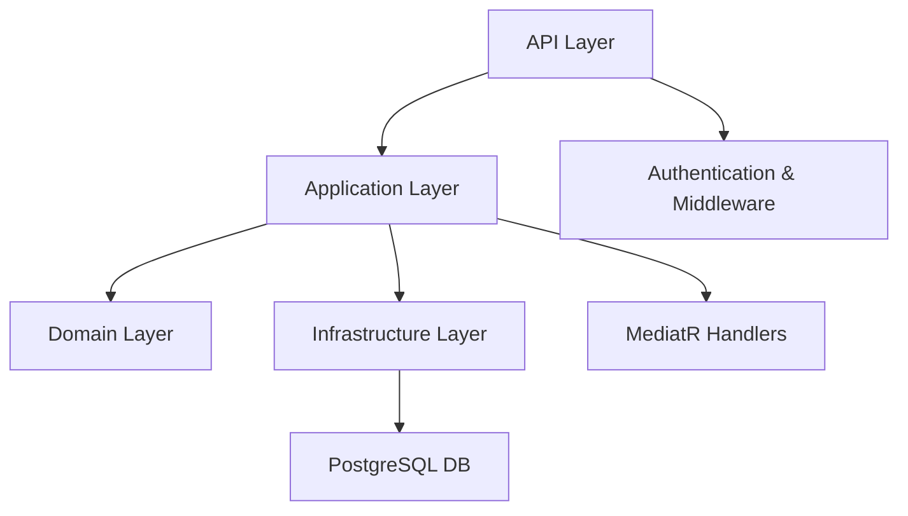

# Incident Reporting System

A cleanly architected .NET 8 Web API for reporting and managing incidents.

---

## 🚀 Features

* RESTful API (v1)
* Create and update incident reports
* Filter and search incidents
* View statistics by category and severity
* JWT-based authentication (demo only)
* Full Swagger UI documentation
* PostgreSQL database
* Docker Compose support

---

## ⚙️ Getting Started

### 1. Requirements

* Docker
* Docker Compose

### 2. Clone the Repository

```bash
git clone https://github.com/your-org/IncidentReportingSystem.git
cd IncidentReportingSystem
```

### 3. Environment Configuration

Copy the example environment file and rename it:

```bash
cp .env.example .env
```

> You can customize the values in the `.env` file (e.g., ports, passwords), but the defaults should work out of the box.

---

## 🐳 Running the Application

Use Docker Compose to start all services:

```bash
docker compose up --build
```

The following services will be available:

| Service          | URL                                                                                  |
| ---------------- | ------------------------------------------------------------------------------------ |
| API (Swagger UI) | [http://localhost:8080/swagger/index.html](http://localhost:8080/swagger/index.html) |
| pgAdmin          | [http://localhost:5050](http://localhost:5050)                                       |

> 📌 **Note:** pgAdmin default port is **5050**.

---

## 🔐 Authentication (Demo Only)

All endpoints require a valid JWT token in the `Authorization` header:

```
Authorization: Bearer your-token-here
```

To generate a demo token, use the following hardcoded values:

```json
{
  "userId": "demo",
  "role": "Admin"
}
```

> 🔒 No real authentication or identity provider is implemented — this is for demo purposes only.

---

## 📊 Swagger UI

Swagger is enabled to help you explore and test the API.

* URL: [http://localhost:8080/swagger/index.html](http://localhost:8080/swagger/index.html)
* Click **"Authorize"** and paste your JWT token to access endpoints

---

## 📁 Project Structure

```plaintext
IncidentReportingSystem
├── .env.example                            → Sample environment variables
├── docker-compose.yml                     → Main Docker Compose setup
├── IncidentReportingSystem.API            → Controllers, Middleware
├── IncidentReportingSystem.Application    → CQRS Handlers, Validators
├── IncidentReportingSystem.Domain         → Domain models and Enums
├── IncidentReportingSystem.Infrastructure → EF Core, Repositories
├── IncidentReportingSystem.Tests          → Unit & Integration tests
```

---

## 🧪 Running Tests

```bash
dotnet test
```

---

## 🏗️ Architecture

This project follows the principles of **Clean Architecture**, separating concerns across layers:

* `API` Layer: Handles HTTP requests, routing, and middleware.
* `Application` Layer: Contains business logic, CQRS handlers, validators, and MediatR setup.
* `Domain` Layer: Defines core domain models and enumerations.
* `Infrastructure` Layer: Implements persistence logic using EF Core.
* `Tests`: Unit and integration test projects.



> 🧠 This architecture enforces separation of concerns and allows for maintainability, scalability, and testability.

---

## 📝 License

This project is licensed under the MIT License.
