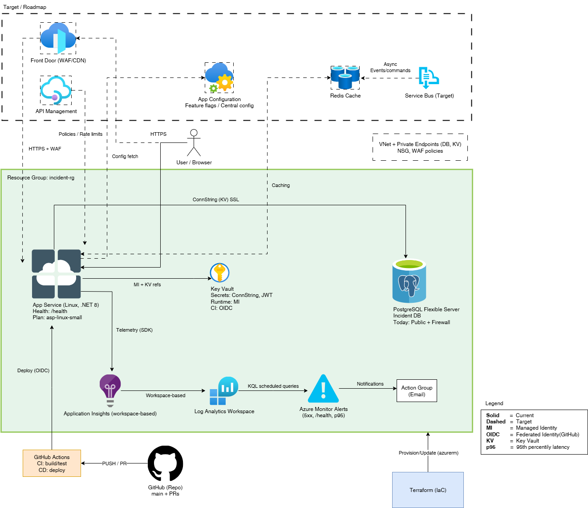

# IncidentReportingSystem — .NET 8 API on Azure (Terraform) + Upcoming UI

[](https://github.com/guysneh/IncidentReportingSystem/actions/workflows/deploy.yml)

A compact, production‑minded **.NET 8 Web API** showcasing clean architecture, JWT security, **observability by default**, and **Terraform‑first** Azure infrastructure.  
A lightweight **UI** is planned and tracked in the *Roadmap* section below.

> Live Swagger: https://incident-api.azurewebsites.net/swagger/index.html

---

## Table of Contents
- [Highlights](#highlights)
- [Architecture](#architecture)
- [Screenshots](#screenshots)
- [Tech Stack](#tech-stack)
- [Getting Started](#getting-started)
- [Security](#security)
- [Observability](#observability)
- [Infrastructure (Terraform)](#infrastructure-terraform)
- [CI/CD](#cicd)
- [Testing](#testing)
- [Roadmap (UI + backlog)](#roadmap-ui--backlog)
- [Conventions](#conventions)
- [License](#license)
- [Cloud API (Production)](#-cloud-api-production)
- [API Endpoints (Authoritative)](#-api-endpoints-authoritative)
- [Running with Docker Compose](#-running-with-docker-compose)
- [Cloud & Security (What’s live today)](#-cloud--security-whats-live-today)
- [Request Flow (End-to-End)](#-request-flow-end-to-end)
- [CI/CD Pipeline Flow (GitHub Actions + Terraform)](#-cicd-pipeline-flow-github-actions--terraform)
- [Operational & Diagnostics Endpoints (non-Swagger)](#operational--diagnostics-endpoints-non-swagger)
- [Configuration Demo Playbook (Sentinel, Cache/TTL, Refresh)](#configuration-demo-playbook-sentinel-cachettl-refresh)
- [Feature Flags & Swagger Gating](#feature-flags--swagger-gating)
- [JWT Key Rotation (Design Notes)](#jwt-key-rotation-with-kid-optional-design-notes)
- [Troubleshooting](#troubleshooting)

---

## Highlights
- **Clean Architecture** boundaries (Domain, Application, Infrastructure, API) with clear responsibilities.
- **.NET 8** (ASP.NET Core) with **MediatR** command/query handlers and **FluentValidation**.
- **API Versioning** (v1 now), enums rendered as strings in OpenAPI.
- **Security:** Signed **JWT (HS256)**, ValidateIssuer/Audience/Lifetime, roles & claims; `[Authorize]` baked into controllers.
- **Resilience:** Timeouts + `CancellationToken` honored end‑to‑end; developer‑friendly problem details on errors.
- **Observability:** **Application Insights** + **KQL** queries, structured logs with correlation IDs, `/health` endpoint.
- **Infra as Code:** Terraform modules (RG, App Service/Plan, PostgreSQL Flexible Server, Key Vault, App Insights, budget/tags). Managed Identity with **Key Vault references** in App Service.
- **CI/CD:** GitHub Actions (OIDC) — build → unit + integration tests → deploy to Azure.
- **Cost awareness:** Global tagging via `var.default_tags`, budget guardrails.
- **Database:** EF Core with migrations; PostgreSQL Flexible Server.

---

## Architecture

```
repo-root/
├─ src/
│  ├─ IncidentReportingSystem.API/              # ASP.NET Core (.NET 8), Swagger, versioning
│  ├─ IncidentReportingSystem.Application/      # MediatR, validators, DTOs
│  ├─ IncidentReportingSystem.Domain/           # Entities, enums, domain logic
│  └─ IncidentReportingSystem.Infrastructure/   # EF Core, repositories, JWT, logging
├─ tests/
│  ├─ Unit/
│  └─ Integration/                              # WebApplicationFactory, authenticated HttpClient
├─ terraform/
│  ├─ main.tf / variables.tf / outputs.tf
│  └─ modules/
│     ├─ resource_group/  ├─ app_service_plan/ ├─ app_service/
│     ├─ postgres/        ├─ key_vault/        └─ app_insights/
└─ docs/
   └─ images/
      ├─ architecture.png
      ├─ swagger.png
      ├─ kql-dashboard.png
      └─ pipeline.png
```

### Diagram


---

**Swagger**


**KQL Dashboard (Application Insights)**


**CI/CD Pipeline**


---

## Tech Stack
- **Backend:** .NET 8, ASP.NET Core, MediatR, FluentValidation, API Versioning
- **Data:** Entity Framework Core, PostgreSQL Flexible Server
- **Security:** JWT (HS256), ValidateIssuer/Audience/Lifetime, roles & claims
- **Observability:** Application Insights, KQL
- **Infra:** Terraform (Azure: App Service Linux, Key Vault, App Insights, Budgets/Tags)
- **CI/CD:** GitHub Actions (OIDC to Azure)

---

## Getting Started

### Prerequisites
- .NET 8 SDK
- PostgreSQL (local) or Azure PostgreSQL Flexible Server
- PowerShell/Bash
- (Optional) Azure CLI for cloud deployment

### Run locally
```bash
# From repo root:
dotnet restore
dotnet build

# Run API (Development profile reads appsettings.Development.json)
dotnet run --project src/IncidentReportingSystem.API
```

The API will expose Swagger UI at `https://localhost:5xxx/swagger` (port per launchSettings).

### EF Core Migrations (local)
```bash
# Create a migration
dotnet ef migrations add Init --project src/IncidentReportingSystem.Infrastructure --startup-project src/IncidentReportingSystem.API

# Apply migrations
dotnet ef database update --project src/IncidentReportingSystem.Infrastructure --startup-project src/IncidentReportingSystem.API
```

---

## Security
- HS256 **JWT** issued for demo via `/api/v1/Auth/token?userId=…&role=…` (issuer/audience/lifetime validated).
- Roles/claims drive `[Authorize]` attributes.
- No secrets in code. App Service uses **Key Vault references** (ConnectionStrings__DefaultConnection, Jwt__Issuer/Audience/Secret).

---

## Observability
- **Application Insights** connection is provided via `APPLICATIONINSIGHTS_CONNECTION_STRING`.
- Structured logging with correlation IDs; request/response + failures captured.
- **KQL** examples in `docs/kql/` (create this folder if missing).
- Health endpoint: `/health`.

---

## Infrastructure (Terraform)
- Modules: `resource_group`, `app_service_plan`, `app_service`, `postgres`, `key_vault`, `app_insights`, `budget`.
- **Always tag** resources with `tags = var.default_tags`.
- PostgreSQL firewall rules: allow App Service outbound IPs (or AllowAllAzureIPs for demo).
- Secrets:
  - `PostgreSqlConnectionString`
  - `jwt-issuer`, `jwt-audience`, `jwt-secret`
- App settings in App Service:
  - `ConnectionStrings__DefaultConnection` → Key Vault reference
  - `Jwt__Issuer`, `Jwt__Audience`, `Jwt__Secret` → Key Vault references
  - `EnableSwagger=true`

**Apply**
```bash
cd terraform
terraform init -upgrade
terraform validate
terraform plan
terraform apply
```

---

## CI/CD
- GitHub Actions with **OIDC** to Azure.
- Jobs: build → test (unit + integration) → publish → deploy to App Service.
- EF Core migrations can be toggled during deploy as needed.

---
## Testing
- **Unit tests** focus on handlers/validators.
- **Integration tests** use `WebApplicationFactory` with authenticated `HttpClient` and seeded PostgreSQL.
- Both test suites run in CI; failures block deployment.

---

## Roadmap (UI + backlog)
### UI (planned)
- Minimal **React/Next.js** admin for incident list, details, and status updates.
- Auth via demo JWT; later, wire to real IdP if needed.
- Simple charts (open vs. resolved, by severity).

### Backend backlog
- Pagination & sorting on list endpoint.
- Idempotency keys for create.
- Rate limiting & circuit breaker guards.
- More KQL dashboards.

---

## Conventions
- Language: **English** for code, comments, commits, and docs.
- No secrets in code or plain terraform files; use Key Vault references.
- Keep modules cohesive and tagged (`var.default_tags`).

---

## License
MIT (or choose a license appropriate for your repo).

---

## 🌐 Cloud API (Production)
The API is deployed to Azure App Service. Public Swagger UI:
**https://incident-api.azurewebsites.net/swagger/index.html**

> Tip: Production uses Azure App Configuration + Key Vault. Local runs (Docker Compose) use your `.env`.

---

## 📖 API Endpoints (Authoritative)
> These reflect the current implementation. Authentication uses JWT (HS256). Roles: **Admin**, **User**.

### Auth (Anonymous access)
- **POST `/api/v1/Auth/register`**  
  Register a new user. Returns basic profile, no token.
- **POST `/api/v1/Auth/login`**  
  Authenticate with credentials, returns a signed JWT.

### Incident Reports
- **POST `/api/v1/IncidentReports`** *(User, Admin)*  
  Create a new incident report.
- **GET `/api/v1/IncidentReports/{id}`** *(User, Admin)*  
  Get incident by ID.
- **GET `/api/v1/IncidentReports`** *(User, Admin)*  
  List incidents. Supports filters (e.g., status, severity, category).
- **PUT `/api/v1/IncidentReports/{id}/status`** *(Admin only)*  
  Update status for a single incident.
- **POST `/api/v1/IncidentReports/bulk-status`** *(Admin only; Idempotent)*  
  Bulk update multiple incidents’ statuses. Designed to be **idempotent** (replays are safe).

### Demo / Configuration
- **GET `/api/v1/config-demo`** *(Admin only)*  
  Demonstrates **feature flags** and centralized configuration via **Azure App Configuration**.

> For the full interactive surface, see Swagger locally at `http://localhost:8080/swagger` (Docker Compose) or in production at the link above.
---

## Operational & Diagnostics Endpoints (non-Swagger)

> These routes are intentionally **not** exposed in Swagger UI, so they remain simple operational probes.

### Health
- `GET /health/live`  
  Liveness probe. Returns `{ "status": "ok" }`. **No auth** required.

- `GET /health`  
  Readiness/health checks (e.g., PostgreSQL via Npgsql). **No auth** required.

### Configuration Diagnostics
- `GET /diagnostics/config`  
  Returns the current view of key config values:
  ```json
  {
    "AppConfigEnabled": "true",
    "Label": "prod",
    "Sentinel": "2",
    "CacheSeconds": "90",
    "SampleRatio": "1.0"
  }
  ```

- `GET /diagnostics/config/refresh-state`  
  Shows when options were **last re-bound** (UTC). Useful to verify a refresh occurred:
  ```json
  { "lastRefreshUtc": "2025-08-20T18:12:05.1234567Z" }
  ```

- `POST /diagnostics/config/force-refresh`  
  Forces an immediate refresh attempt (bypasses the configured TTL). Handy for demos/tests:
  ```json
  { "forced": true, "atUtc": "2025-08-20T18:12:34.5678901Z" }
  ```

> Tip: All diagnostics endpoints are anonymous and excluded from Swagger (`ExcludeFromDescription`).


## Feature Flags & Swagger Gating

We use **Azure App Configuration Feature Flags** to gate Swagger UI when App Configuration is active.

- Feature flag name: **`EnableSwaggerUI`**
- Behavior:
  - If App Configuration is **inactive** → Swagger UI is **always** accessible (local dev safety).
  - If App Configuration is **active** → access to `/swagger` is allowed **only when** `EnableSwaggerUI = true`.

**To demo:**
1. Ensure App Configuration is active (see `/diagnostics/config` → `AppConfigEnabled=true`).
2. In **App Configuration → Feature manager**, toggle **`EnableSwaggerUI`** to **false** (match the same Label).
3. Wait for the Feature Flags cache TTL (see `AppConfig__CacheSeconds`) **or** call:
   ```
   POST /diagnostics/config/force-refresh
   ```
4. Browse `/swagger` → you should get **404 Not Found**.
5. Toggle back to **true**, wait TTL or force refresh → `/swagger` works again.

> Note: Feature flags are cached with the same TTL you configured (`AppConfig__CacheSeconds`), and also refresh on force-refresh.


## Configuration Demo Playbook (Sentinel, Cache/TTL, Refresh)

The app uses:
- **In-memory cache** for key-values with TTL = `AppConfig__CacheSeconds`.
- **Sentinel key** `AppConfig:Sentinel` to trigger a **hot refresh** of all watched keys (checked when TTL elapses).
- **Force-refresh** endpoint to bypass TTL during demos/tests.

### Prerequisites
- App Settings (in App Service) were set by Terraform:
  - `AppConfig__Enabled=true`
  - `AppConfig__Endpoint=https://<your-appcfg>.azconfig.io`
  - `AppConfig__Label=prod`
  - `AppConfig__CacheSeconds=90` (example)
- Keys exist in App Configuration (with the **same Label**):
  - `AppConfig:Sentinel = "1"`
  - `MyAppSettings:SampleRatio = "1.0"`

### Baseline
```
GET /diagnostics/config
```
Expect something like:
```json
{ "AppConfigEnabled": "true", "Label": "prod", "Sentinel": "1", "CacheSeconds": "90", "SampleRatio": "1.0" }
```

### A) Demonstrate **Cache & TTL**
1. In App Configuration (label `prod`), change:
   - `MyAppSettings:SampleRatio` → `0.7`
   - **Do not** change the sentinel yet.
2. Immediately call:
   ```
   GET /diagnostics/config
   ```
   You should still see `SampleRatio = 1.0` (cached).
3. Wait for **TTL** (e.g., 90s) → call again → you’ll see `0.7`.

> This proves the in-memory cache holds values until TTL elapses.

### B) Demonstrate **Sentinel-based refresh**
1. In App Configuration (label `prod`), **bump**:
   - `AppConfig:Sentinel` → from `1` to `2`
2. After TTL elapses, the next request will notice the sentinel change and **refresh** values.
3. Call:
   ```
   GET /diagnostics/config
   GET /diagnostics/config/refresh-state
   ```
   You should see the new `Sentinel = "2"` and an updated `lastRefreshUtc`.

> Sentinel is evaluated when the TTL window expires. Use **force refresh** to bypass TTL during demos.

### C) Demonstrate **Force Refresh (bypass TTL)**
1. Change a value in App Configuration (e.g., `SampleRatio`).
2. Immediately call:
   ```
   POST /diagnostics/config/force-refresh
   GET  /diagnostics/config
   ```
   You should see the new value **right away**, without waiting for TTL.

### CLI (Optional)
You can also change keys via Azure CLI:
```bash
# Update SampleRatio (label=prod)
az appconfig kv set --name <APP_CONFIG_NAME> --key "MyAppSettings:SampleRatio" --value "0.7" --label "prod"

# Bump the sentinel (label=prod)
az appconfig kv set --name <APP_CONFIG_NAME> --key "AppConfig:Sentinel" --value "2" --label "prod"
```


## Rate Limiting (FYI)

The API uses a simple **fixed-window** global rate limiter (e.g., 10 requests / 10 seconds, queue limit 5).  
If you fire more than the allowed rate, you will get **HTTP 429 Too Many Requests**.

**Quick check (bash loop):**
```bash
for i in {1..20}; do curl -s -o /dev/null -w "%{http_code}\n" https://<your-app>/health/live; done
# You should see some 200s and some 429s within a 10-second window.
```


## Local / Offline Mode (no App Configuration)

- Local dev and Docker compose use:
  - `AppConfig__Enabled=false`
  - Optional defaults in `appsettings.Development.json` or environment variables
- Diagnostics routes work the same:
  - `GET /diagnostics/config` will show `AppConfigEnabled=false`
  - You can still exercise health endpoints and any feature defaults you set locally


## JWT Key Rotation with `kid` (Optional, Design Notes)

> Current code signs/validates JWT using a **single symmetric secret** (`Jwt:Secret`). This section documents the **recommended** approach to move toward key rotation with **`kid`**. It’s optional and can be implemented later without breaking clients.

### Current State
- Signing: HS256 with one key from configuration (`Jwt:Secret`).
- Validation: one `IssuerSigningKey` configured at startup.
- Rotation impact: changing the secret invalidates all existing tokens immediately.

### Recommended Rotation Model
- Keep **two signing keys** active during a rotation window:
  - New tokens are signed with the **current key** (e.g., `kid = k2`).
  - Validation accepts both **k1** and **k2** (based on the token header `kid`).
- Store keys in **Key Vault** and reference their values via **App Configuration**:
  - `Jwt:SigningKeys:k1` → Key Vault secret (old)
  - `Jwt:SigningKeys:k2` → Key Vault secret (new/current)
  - `Jwt:ActiveKid`      → `"k2"`
- Use App Configuration **sentinel** + TTL so the app learns about key changes **without restarts**.

### Minimal Validation Snippet (Conceptual)
```csharp
// Pseudo: wiring multiple keys by 'kid' (to be added when you move to rotation)
var keysByKid = new ConcurrentDictionary<string, SecurityKey>(StringComparer.OrdinalIgnoreCase);

// On config refresh (e.g., via IOptionsMonitor or manual reload), rebuild the map:
keysByKid["k1"] = new SymmetricSecurityKey(Encoding.UTF8.GetBytes(cfg["Jwt:SigningKeys:k1"]));
keysByKid["k2"] = new SymmetricSecurityKey(Encoding.UTF8.GetBytes(cfg["Jwt:SigningKeys:k2"]));

var tvp = new TokenValidationParameters
{
    // ...
    ValidateIssuerSigningKey = true,
    IssuerSigningKeyResolver = (token, secToken, kid, parameters) =>
        (kid != null && keysByKid.TryGetValue(kid, out var key))
            ? new[] { key } : Array.Empty<SecurityKey>()
};
// The issuer uses cfg["Jwt:ActiveKid"] to choose which key to sign with.
```

### Rotation Timeline
1. **Prepare**: Generate a new key, add it as `k2` in Key Vault/App Config; set `Jwt:ActiveKid = "k2"` for the issuer.
2. **Overlap**: Keep **k1 & k2** available for validation (clients with old tokens continue to work).
3. **Expire old tokens**: Wait until the longest token lifetime has passed (e.g., 60 minutes).
4. **Retire**: Remove `k1` from validation and delete its secret from Key Vault.

> Benefit: No restart and no mass invalidation of in-flight tokens.


## Troubleshooting

### App Configuration not applied
- `/diagnostics/config` shows `AppConfigEnabled=false` or missing endpoint:
  - Verify App Service **App Settings**: `AppConfig__Enabled`, `AppConfig__Endpoint`, `AppConfig__Label`, `AppConfig__CacheSeconds`.
  - Check **RBAC**: API’s Managed Identity must have **App Configuration Data Reader** on the store.
  - If using private networking/firewall, ensure the Web App can reach the endpoint.

### Values still not refreshing
- Ensure the key changes are under the **same Label** used by the app.
- Remember: refresh happens when **TTL elapses**; either wait for `AppConfig__CacheSeconds` or call `POST /diagnostics/config/force-refresh`.
- Confirm the **sentinel key** `AppConfig:Sentinel` was bumped (and with the same label).

### Swagger shows 404
- When App Configuration is active, `/swagger` depends on the **`EnableSwaggerUI`** feature flag.
- Toggle the flag to `true`, then wait for TTL or **force refresh**.

### 401/403 after changing roles/flags
- Tokens issued **before** the change carry old claims until they **expire**. Re-authenticate to get a fresh token.

### Rate limiting 429
- Expected under burst traffic; reduce call rate or tune the limiter settings if needed.

### Local dev
- Use `AppConfig__Enabled=false` (or provide environment credentials & endpoint to talk to real App Config).
- `GET /diagnostics/config` will clearly show the current mode.

---

## 🐳 Running with Docker Compose
This repository includes a complete local stack (API + DB + pgAdmin + migrations).

### Prerequisites
- Docker & Docker Compose
- .NET 8 SDK (for optional local debugging / manual migrations)
- Copy environment file:  
  ```bash
  cp .env.example .env
  ```
  You may keep defaults as-is. **Do not commit `.env`** if it contains real secrets.

### Start the stack
```bash
docker-compose up --build
```
Services started:
- `db` — PostgreSQL
- `pgadmin` — UI for Postgres (see credentials in `.env`), open http://localhost:5050
- `migrations` — runs EF Core migrations **automatically**
- `api` — waits for DB + migrations, then starts

URLs:
- Swagger: http://localhost:8080/swagger  
- pgAdmin: http://localhost:5050

### Manual EF Core migrations (outside Docker)
Docker Compose already applies migrations. When running API outside Compose you can run:
```bash
dotnet ef database update --project IncidentReportingSystem.Infrastructure
```
(Adjust the project path if needed.)

---

## ☁️ Cloud & Security (What’s live today)
- **Azure App Service (Linux, .NET 8)** hosts the API.
- **Azure PostgreSQL Flexible Server** is the database.
- **Azure Key Vault** stores secrets (e.g., DB password, `jwt-secret`, issuer, audience).  
  - The **JWT secret** is injected by the **deployment pipeline** (not stored in Terraform state).
- **Azure App Configuration** holds **non‑secret** settings + **feature flags** (e.g., `FeatureManagement:...`, `AppConfiguration:Sentinel`).
- **Application Insights + Log Analytics** for observability (requests, exceptions, p95, dashboards).
---

## 🔁 Request Flow (End-to-End)
1. **Client** (Swagger / UI) sends request (JWT in `Authorization: Bearer <token>` when required).
2. **ASP.NET Core** authenticates & authorizes (roles Admin/User).
3. **Controller** delegates to **MediatR** (Command/Query).
4. **Application layer** applies validation and orchestrates business logic.
5. **Infrastructure (EF Core)** executes SQL against **PostgreSQL**.
6. **Cross‑cutting** concerns: structured logging, correlation, metrics → **Application Insights**.
7. For config values/feature flags: **Azure App Configuration** is queried (with refresh via sentinel).  
   For secrets: **Key Vault** is referenced via Managed Identity.
8. **Response** is returned with proper problem details on errors.

---

## 🚀 CI/CD Pipeline Flow (GitHub Actions + Terraform)
1. **Checkout & Restore** → build & unit tests.
2. **Terraform Init/Plan/Apply** → provisions/updates Azure infra (App Service, DB, Key Vault, App Configuration, Insights).
3. **Secrets Injection** → pipeline writes **JWT secret** and **DB connection string** to **Key Vault**.
4. **Build & Publish** →  code coverage / Unit Tests / Integration Tests / artifacts.
5. **Deploy to App Service** → health probe
6. **Observability** → logs/traces in **Application Insights**, alerts via Azure Monitor.

> Pipelines exist for both **Build** and **Deploy**; Terraform manages IaC. OIDC is used for secure federation to Azure (no static creds).
