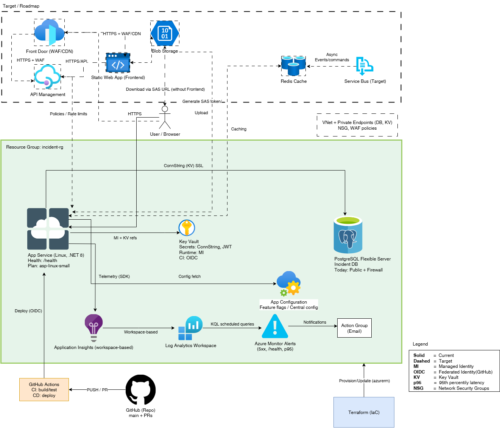

# IncidentReportingSystem — .NET 8 API on Azure (Terraform) + Upcoming UI

[](https://github.com/guysneh/IncidentReportingSystem/actions/workflows/deploy.yml)

A compact, production‑minded **.NET 8 Web API** showcasing clean architecture, JWT security, **observability by default**, and **Terraform‑first** Azure infrastructure.  
A lightweight **UI** is planned and tracked in the *Roadmap* section below.

> Live Swagger: https://incident-api.azurewebsites.net/swagger/index.html

---

## Table of Contents
- [Highlights](#highlights)
- [Architecture](#architecture)
- [Screenshots](#screenshots)
- [Tech Stack](#tech-stack)
- [Getting Started](#getting-started)
- [Security](#security)
- [Observability](#observability)
- [Infrastructure (Terraform)](#infrastructure-terraform)
- [CI/CD](#cicd)
- [Testing](#testing)
- [Roadmap (UI + backlog)](#roadmap-ui--backlog)
- [Conventions](#conventions)
- [License](#license)

---

## Highlights
- **Clean Architecture** boundaries (Domain, Application, Infrastructure, API) with clear responsibilities.
- **.NET 8** (ASP.NET Core) with **MediatR** command/query handlers and **FluentValidation**.
- **API Versioning** (v1 now), enums rendered as strings in OpenAPI.
- **Security:** Signed **JWT (HS256)**, ValidateIssuer/Audience/Lifetime, roles & claims; `[Authorize]` baked into controllers.
- **Resilience:** Timeouts + `CancellationToken` honored end‑to‑end; developer‑friendly problem details on errors.
- **Observability:** **Application Insights** + **KQL** queries, structured logs with correlation IDs, `/health` endpoint.
- **Infra as Code:** Terraform modules (RG, App Service/Plan, PostgreSQL Flexible Server, Key Vault, App Insights, budget/tags). Managed Identity with **Key Vault references** in App Service.
- **CI/CD:** GitHub Actions (OIDC) — build → unit + integration tests → deploy to Azure.
- **Cost awareness:** Global tagging via `var.default_tags`, budget guardrails.
- **Database:** EF Core with migrations; PostgreSQL Flexible Server.

---

## Architecture

```
repo-root/
├─ src/
│  ├─ IncidentReportingSystem.API/              # ASP.NET Core (.NET 8), Swagger, versioning
│  ├─ IncidentReportingSystem.Application/      # MediatR, validators, DTOs
│  ├─ IncidentReportingSystem.Domain/           # Entities, enums, domain logic
│  └─ IncidentReportingSystem.Infrastructure/   # EF Core, repositories, JWT, logging
├─ tests/
│  ├─ Unit/
│  └─ Integration/                              # WebApplicationFactory, authenticated HttpClient
├─ terraform/
│  ├─ main.tf / variables.tf / outputs.tf
│  └─ modules/
│     ├─ resource_group/  ├─ app_service_plan/ ├─ app_service/
│     ├─ postgres/        ├─ key_vault/        └─ app_insights/
└─ docs/
   └─ images/
      ├─ architecture.png
      ├─ swagger.png
      ├─ kql-dashboard.png
      └─ pipeline.png
```

### Diagram


---

**Swagger**


**KQL Dashboard (Application Insights)**


**CI/CD Pipeline**


---

## Tech Stack
- **Backend:** .NET 8, ASP.NET Core, MediatR, FluentValidation, API Versioning
- **Data:** Entity Framework Core, PostgreSQL Flexible Server
- **Security:** JWT (HS256), ValidateIssuer/Audience/Lifetime, roles & claims
- **Observability:** Application Insights, KQL
- **Infra:** Terraform (Azure: App Service Linux, Key Vault, App Insights, Budgets/Tags)
- **CI/CD:** GitHub Actions (OIDC to Azure)

---

## Getting Started

### Prerequisites
- .NET 8 SDK
- PostgreSQL (local) or Azure PostgreSQL Flexible Server
- PowerShell/Bash
- (Optional) Azure CLI for cloud deployment

### Run locally
```bash
# From repo root:
dotnet restore
dotnet build

# Run API (Development profile reads appsettings.Development.json)
dotnet run --project src/IncidentReportingSystem.API
```

The API will expose Swagger UI at `https://localhost:5xxx/swagger` (port per launchSettings).

### EF Core Migrations (local)
```bash
# Create a migration
dotnet ef migrations add Init --project src/IncidentReportingSystem.Infrastructure --startup-project src/IncidentReportingSystem.API

# Apply migrations
dotnet ef database update --project src/IncidentReportingSystem.Infrastructure --startup-project src/IncidentReportingSystem.API
```

---

## Security
- HS256 **JWT** issued for demo via `/api/v1/Auth/token?userId=…&role=…` (issuer/audience/lifetime validated).
- Roles/claims drive `[Authorize]` attributes.
- No secrets in code. App Service uses **Key Vault references** (ConnectionStrings__DefaultConnection, Jwt__Issuer/Audience/Secret).

---

## Observability
- **Application Insights** connection is provided via `APPLICATIONINSIGHTS_CONNECTION_STRING`.
- Structured logging with correlation IDs; request/response + failures captured.
- **KQL** examples in `docs/kql/` (create this folder if missing).
- Health endpoint: `/health`.

---

## Infrastructure (Terraform)
- Modules: `resource_group`, `app_service_plan`, `app_service`, `postgres`, `key_vault`, `app_insights`, `budget`.
- **Always tag** resources with `tags = var.default_tags`.
- PostgreSQL firewall rules: allow App Service outbound IPs (or AllowAllAzureIPs for demo).
- Secrets:
  - `PostgreSqlConnectionString`
  - `jwt-issuer`, `jwt-audience`, `jwt-secret`
- App settings in App Service:
  - `ConnectionStrings__DefaultConnection` → Key Vault reference
  - `Jwt__Issuer`, `Jwt__Audience`, `Jwt__Secret` → Key Vault references
  - `EnableSwagger=true`

**Apply**
```bash
cd terraform
terraform init -upgrade
terraform validate
terraform plan
terraform apply
```

---

## CI/CD
- GitHub Actions with **OIDC** to Azure.
- Jobs: build → test (unit + integration) → publish → deploy to App Service.
- EF Core migrations can be toggled during deploy as needed.

---
## Testing
- **Unit tests** focus on handlers/validators.
- **Integration tests** use `WebApplicationFactory` with authenticated `HttpClient` and seeded PostgreSQL.
- Both test suites run in CI; failures block deployment.

---

## Roadmap (UI + backlog)
### UI (planned)
- Minimal **React/Next.js** admin for incident list, details, and status updates.
- Auth via demo JWT; later, wire to real IdP if needed.
- Simple charts (open vs. resolved, by severity).

### Backend backlog
- Pagination & sorting on list endpoint.
- Idempotency keys for create.
- Rate limiting & circuit breaker guards.
- More KQL dashboards.

---

## Conventions
- Language: **English** for code, comments, commits, and docs.
- No secrets in code or plain terraform files; use Key Vault references.
- Keep modules cohesive and tagged (`var.default_tags`).

---

## License
MIT (or choose a license appropriate for your repo).

---

## 🌐 Cloud API (Production)
The API is deployed to Azure App Service. Public Swagger UI:
**https://incident-api.azurewebsites.net/swagger/index.html**

> Tip: Production uses Azure App Configuration + Key Vault. Local runs (Docker Compose) use your `.env`.

---

## 📖 API Endpoints (Authoritative)
> These reflect the current implementation. Authentication uses JWT (HS256). Roles: **Admin**, **User**.

### Auth (Anonymous access)
- **POST `/api/v1/Auth/register`**  
  Register a new user. Returns basic profile, no token.
- **POST `/api/v1/Auth/login`**  
  Authenticate with credentials, returns a signed JWT.

### Incident Reports
- **POST `/api/v1/IncidentReports`** *(User, Admin)*  
  Create a new incident report.
- **GET `/api/v1/IncidentReports/{id}`** *(User, Admin)*  
  Get incident by ID.
- **GET `/api/v1/IncidentReports`** *(User, Admin)*  
  List incidents. Supports filters (e.g., status, severity, category).
- **PUT `/api/v1/IncidentReports/{id}/status`** *(Admin only)*  
  Update status for a single incident.
- **POST `/api/v1/IncidentReports/bulk-status`** *(Admin only; Idempotent)*  
  Bulk update multiple incidents’ statuses. Designed to be **idempotent** (replays are safe).

### Demo / Configuration
- **GET `/api/v1/config-demo`** *(Admin only)*  
  Demonstrates **feature flags** and centralized configuration via **Azure App Configuration**.

> For the full interactive surface, see Swagger locally at `http://localhost:8080/swagger` (Docker Compose) or in production at the link above.

---

## 🐳 Running with Docker Compose
This repository includes a complete local stack (API + DB + pgAdmin + migrations).

### Prerequisites
- Docker & Docker Compose
- .NET 8 SDK (for optional local debugging / manual migrations)
- Copy environment file:  
  ```bash
  cp .env.example .env
  ```
  You may keep defaults as-is. **Do not commit `.env`** if it contains real secrets.

### Start the stack
```bash
docker-compose up --build
```
Services started:
- `db` — PostgreSQL
- `pgadmin` — UI for Postgres (see credentials in `.env`), open http://localhost:5050
- `migrations` — runs EF Core migrations **automatically**
- `api` — waits for DB + migrations, then starts

URLs:
- Swagger: http://localhost:8080/swagger  
- pgAdmin: http://localhost:5050

### Manual EF Core migrations (outside Docker)
Docker Compose already applies migrations. When running API outside Compose you can run:
```bash
dotnet ef database update --project IncidentReportingSystem.Infrastructure
```
(Adjust the project path if needed.)

---

## ☁️ Cloud & Security (What’s live today)
- **Azure App Service (Linux, .NET 8)** hosts the API.
- **Azure PostgreSQL Flexible Server** is the database.
- **Azure Key Vault** stores secrets (e.g., DB password, `jwt-secret`, issuer, audience).  
  - The **JWT secret** is injected by the **deployment pipeline** (not stored in Terraform state).
- **Azure App Configuration** holds **non‑secret** settings + **feature flags** (e.g., `FeatureManagement:...`, `AppConfiguration:Sentinel`).
- **Application Insights + Log Analytics** for observability (requests, exceptions, p95, dashboards).
---

## 🔁 Request Flow (End-to-End)
1. **Client** (Swagger / UI) sends request (JWT in `Authorization: Bearer <token>` when required).
2. **ASP.NET Core** authenticates & authorizes (roles Admin/User).
3. **Controller** delegates to **MediatR** (Command/Query).
4. **Application layer** applies validation and orchestrates business logic.
5. **Infrastructure (EF Core)** executes SQL against **PostgreSQL**.
6. **Cross‑cutting** concerns: structured logging, correlation, metrics → **Application Insights**.
7. For config values/feature flags: **Azure App Configuration** is queried (with refresh via sentinel).  
   For secrets: **Key Vault** is referenced via Managed Identity.
8. **Response** is returned with proper problem details on errors.

---

## 🚀 CI/CD Pipeline Flow (GitHub Actions + Terraform)
1. **Checkout & Restore** → build & unit tests.
2. **Terraform Init/Plan/Apply** → provisions/updates Azure infra (App Service, DB, Key Vault, App Configuration, Insights).
3. **Secrets Injection** → pipeline writes **JWT secret** and **DB connection string** to **Key Vault**.
4. **Build & Publish** →  code coverage / Unit Tests / Integration Tests / artifacts.
5. **Deploy to App Service** → health probe
6. **Observability** → logs/traces in **Application Insights**, alerts via Azure Monitor.

> Pipelines exist for both **Build** and **Deploy**; Terraform manages IaC. OIDC is used for secure federation to Azure (no static creds).
